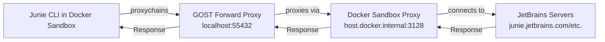

# junie-cli-docker-sandbox

A decently secure way to run Junie CLI in a Docker Sandbox until official Docker support is added.  
See [Current Problems](#current-problems) for why the security level of this repo is lower than official support.

## Architecture



## Setup

### 1. Build the Sandbox

```shell
docker build -t junie-cli-sandbox:v1 .
```

### 2. Run the Sandbox

```shell
# Navigate to the directory you wish to run Junie on
docker sandbox run -t junie-cli-sandbox:v1 --name junie-sandbox shell
```

Junie will start automatically inside the sandbox.

### Authentication

Authentication currently requires manual configuration in the sandbox.  
Currently, only the manual entry of `Provide Junie API key` within the Sandbox is supported.  
See the [Junie CLI Tokens](https://junie.jetbrains.com/cli) for details.

## How It Works

The sandbox uses a multi-layer proxy approach:

1. **GOST Forward Proxy** - Runs inside the sandbox on `localhost:55432`
2. **Proxychains** - Forces Junie traffic through the local GOST proxy
3. **Docker Sandbox Proxy** - GOST forwards to the sandbox's built-in proxy at `host.docker.internal:3128`
4. **External Access** - The sandbox proxy connects to JetBrains servers

This approach bypasses the Docker sandbox network restrictions by routing all traffic through the sandbox's built-in proxy which already has proper certificate handling.

> **Why GOST + Proxychains?** Docker Sandboxes block direct connections to external IPs via network policies, and the `--allow-host`/`--bypass-host` options didn't work for JetBrains' dynamic cloud IPs. However, the sandbox's built-in proxy (`host.docker.internal:3128`) is designed to provide controlled outbound access. By routing Junie's traffic through GOST to this built-in proxy, we're using the intended outbound path rather than fighting the network restrictions.
>
> **How does this bypass the block?** The built-in proxy runs on the **host**, not inside the sandbox container. The sandbox network policy only restricts traffic originating from inside the container. When traffic goes through `host.docker.internal:3128`, the host makes the actual outbound connection on your behalf - and the host has full network access.
>
> ```
> ❌ Junie → direct to 34.54.111.18 → BLOCKED (container policy applies)
>
> ✅ Junie → GOST → host.docker.internal:3128 → 34.54.111.18 → ALLOWED (host makes the connection)
> ```

## JetBrains Endpoints

Junie connects to the following JetBrains endpoints. If you experience connectivity issues, check `docker sandbox network log` for blocked requests:

- `junie.jetbrains.com`
- `ingrazzio-cloud-prod.labs.jb.gg`
- `resources.jetbrains.com`
- `api.jetbrains.ai`

> **Note:** These domains may change. Use `docker sandbox network log` to discover blocked requests.

## Helpful Commands

### View Network Logs

Check for blocked requests:

```shell
docker sandbox network log
```

### View Junie Proxy Logs

Inside the sandbox:

```shell
cat /tmp/junie-proxy.log
cat /tmp/gost.log
```

### Cleanup ALL Sandboxes

```shell
docker sandbox reset
```

### Save as Custom Template

Save your configured sandbox as a reusable template:

```shell
docker sandbox save junie-sandbox my-junie-template:v1
```

## Current Problems

This repository addresses the following limitations, which will be resolved as upstream fixes become available.

### Issue 1: Custom Credential Injection

**Problem:** Docker Sandboxes lack native support for scalable credential injection.

**Current Workaround:** Users must manually enter their Junie API key within the Sandbox environment.

**Status:** [#130](https://github.com/docker/desktop-feedback/issues/130)

**Resolution:** Once resolved, credential handling can be externalized and the API key removed from the Sandbox environment.

---

### Issue 2: IP and Host Whitelisting

**Problem:** Docker Sandboxes have limitations with certain IP and host whitelisting rules.

**Current Workaround:** All traffic is routed through the GOST proxy, permitting all outbound connections.

**Status:** [#199](https://github.com/docker/desktop-feedback/issues/199), [#220](https://github.com/docker/desktop-feedback/issues/220)

**Resolution:** The GOST proxy layer can be removed in favor of the built-in proxy configuration.

---

### Issue 3: No Official Junie Support

**Problem:** Docker Sandboxes do not officially support Junie at this time.

**Current Workaround:** This repository provides a community-maintained implementation.

**Status:** [Supported agents list](https://docs.docker.com/ai/sandboxes/agents/)

**Resolution:** Official support will eliminate the need for this entire repository.


## Resources

- [Junie CLI Documentation](https://junie.jetbrains.com/docs/junie-cli.html)
- [Docker Sandboxes Documentation](https://docs.docker.com/ai/sandbox-templates/)
- [Junie API Key](https://junie.jetbrains.com/cli)
