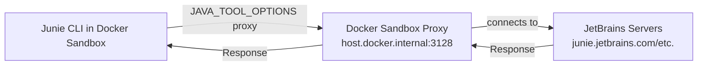

# junie-cli-docker-sandbox

A decently secure way to run Junie CLI in a Docker Sandbox until official Docker support is added.  
See [Current Problems](#current-problems) for why the security level of this repo is lower than official support.

## Architecture



## Setup

### 1. Build the Sandbox

```shell
docker build -t junie-cli-sandbox:v1 .
```

### 2. Run the Sandbox

```shell
# Navigate to the directory you wish to run Junie on
docker sandbox run -t junie-cli-sandbox:v1 --name junie-sandbox shell
```

Junie will start automatically inside the sandbox.

### Authentication

Authentication currently requires manual configuration in the sandbox.  
Currently, only the manual entry of `Provide Junie API key` within the Sandbox is supported.  
See the [Junie CLI Tokens](https://junie.jetbrains.com/cli) for details.

## Helpful Commands

### View Network Logs

Check for blocked requests:

```shell
docker sandbox network log
```

### Cleanup ALL Sandboxes

```shell
docker sandbox reset
```

### Save as Custom Template

Save your configured sandbox as a reusable template:

```shell
docker sandbox save junie-sandbox my-junie-template:v1
```

## Current Problems

This repository addresses the following limitations, which will be resolved as upstream fixes become available.

### Issue 1: Custom Credential Injection

**Problem:** Docker Sandboxes lack native support for scalable credential injection.

**Current Workaround:** Users must manually enter their Junie API key within the Sandbox environment.

**Status:** [#130](https://github.com/docker/desktop-feedback/issues/130)

**Resolution:** Once resolved, credential handling can be externalized and the API key removed from the Sandbox environment.

---

### Issue 2: No Official Junie Support

**Problem:** Docker Sandboxes do not officially support Junie at this time.

**Current Workaround:** This repository provides a community-maintained implementation.

**Status:** [Supported agents list](https://docs.docker.com/ai/sandboxes/agents/)

**Resolution:** Official support will eliminate the need for this entire repository.


## Resources

- [Junie CLI Documentation](https://junie.jetbrains.com/docs/junie-cli.html)
- [Docker Sandboxes CLI Documentation](https://docs.docker.com/reference/cli/docker/sandbox/)
- [Junie API Key](https://junie.jetbrains.com/cli)
